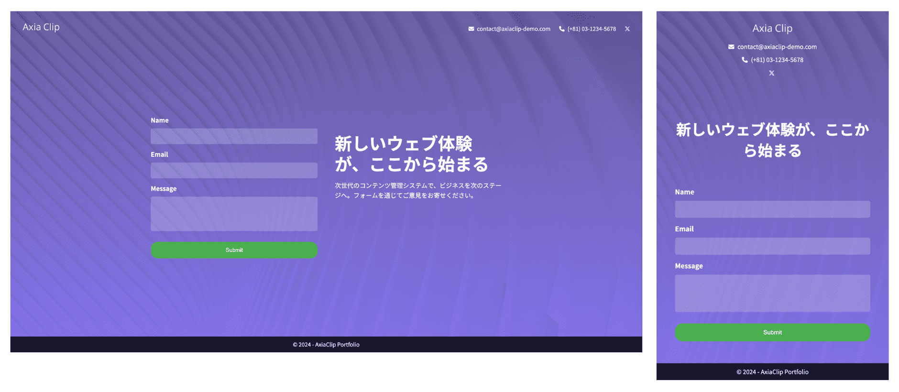

# ポートフォリオサイト

このリポジトリは、HTML と CSS によるシンプルなお問い合わせフォームを提供します。

## 技術スタック

- HTML5
- CSS3
- Normalize.css
- Font Awesome

## デモ

[デモサイトのリンク](https://axiaclip-dev.github.io/contact-form-demo/)

### スナップショット

#### 左: PC 版 | 右: スマホ版



## 機能

- ユーザー名、メールアドレス、メッセージを入力可能
- スタイリッシュなデザイン（背景カラーのグラデーション）
- レスポンシブデザイン（PC とタブレット、スマートフォンに対応）

## ディレクトリ構成

```bash
contact-form-demo/
  |- assets/
  |- index.html
  |- style.css
  |- .gitignore
  |- README.md
```

## インストール

1. リポジトリをクローンします。

```bash
git clone https://github.com/axiaclip-dev/contact-form-demo.git
```

## 著作権

ソースコード、ロゴ、ファビコンの著作権は Axia Clip にあります。

### 画像の著作権

画像は Free 画像を使用しています。クレジットは以下の通りです。

```bash
- background: Photo by [Canva](https://www.canva.com/)
```
